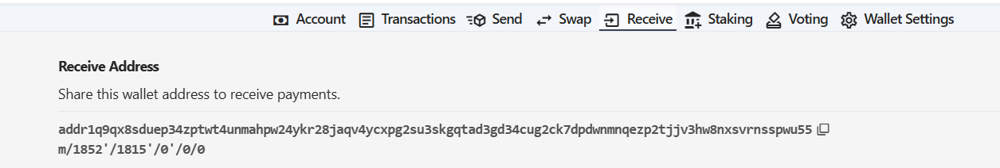
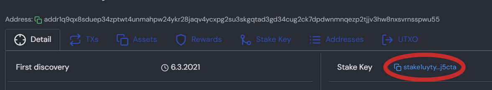
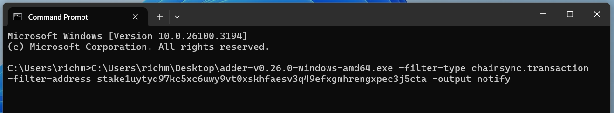
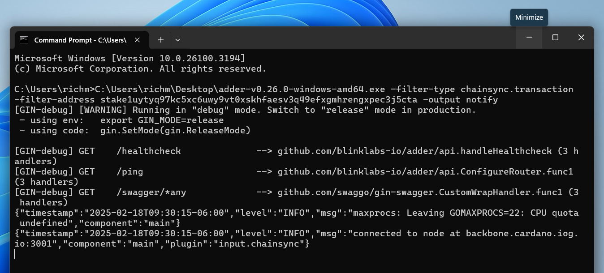

# Watch My Wallet and get a Desktop Notification

Let's walk through how to open Adder, input filters and commands so that it tracks your wallet and gives you a desktop notification when there is a change to your wallet.

> ✅ For this guide we assume you have already downloaded the Adder exe and have opened a command prompt. If not see our [Quick Start](quick-start-overview.md) guide.

***
<a name="step-1" />

## Step 1 - Get Wallet Address

First we need our wallet's receive address or staking address. To find your receive address go to your preferred Cardano wallet. Find the receive tab or button and copy your address. 📝Make a note of address to use later.

<div align="left"><figure><figcaption><p>Receive Address</p></figcaption></figure></div>

To find your staking address you can use tools like [cexplorer.io](https://www.cexplorer.io) to search your receive address and then copy your staking address

Staking Address:
<div align="left"><figure><figcaption><p></p></figcaption></figure></div>

📝Make note of the wallet address you want to use; we will need it later. For this example, we used the following staking address:

```
stake1uytyq97kc5xc6uwy9vt0xskhfaesv3q49efxgmhrengxpec3j5cta
```

***

Now that we have our wallet address that we want to monitor, we are ready to look at the filters and commands we will use. For this example, we will use:

* Filter type
* Filter Address
* Output

## Filter type

The first filter we will add is the filter type. For this example, we want to get alerts when a transaction occurs within our wallet, either when we send or receive an asset. To do this we will add the following filter:

```
-filter-type chainsync.transaction
```

## Filter Address

Next we want to get alerts just for our wallet address. In this example we will use our staking address. To get alerts just for our staking address we will add the following filter:

```
-filter-address stake1uytyq97kc5xc6uwy9vt0xskhfaesv3q49efxgmhrengxpec3j5cta
```

## Output

We want the output to be a desktop notification, so that when a transaction occurs with our wallet, we will receive a desktop notification. To do this we will add the following command:

```
-output notify
```

***

## Step 2 - Putting it All Together

Now that we understand the filters and commands that we want to input into Adder in order to get desktop alerts when we send or receive an asset, we will run the following command in our command prompt:


> ⚠️Please adjust the path to your Adder exe. In this example it's on the Desktop for user richm.\
\
Also make sure you replace the below stake address with your receive or stake address from [Step 1](#step-1)


Command to run once you adjust Adder exe path and your wallet address:


```
C:\Users\richm\Desktop\adder-v0.26.0-windows-amd64.exe -filter-type chainsync.transaction -filter-address stake1uytyq97kc5xc6uwy9vt0xskhfaesv3q49efxgmhrengxpec3j5cta -output notify
```

Final command to run:
<div align="left"><figure><figcaption><p></p></figcaption></figure></div>

After you hit enter to run the command you can minimize the cmd window and let it run in the background. Now when your wallet sends or receives an asset you will get a desktop notification.

Minimize:
<div align="left"><figure><figcaption><p></p></figcaption></figure></div>


Desktop Alert:
<div align="left"><figure><figcaption><p></p></figcaption></figure></div>

### Congratulations!&#x20;

***


> 💡TIP: You can get a list of all available commands by using the `-h` or `-help` flag.

See our other examples to see what else Adder can do and unlock the power of Adder 💪

1. [Example 1](example-1-watch-my-wallet-and-get-a-desktop-notification.md) - Watch My Wallet and get a Desktop Notification
2. [Example 2](example-2-watch-a-token-and-get-a-desktop-notification.md) - Watch a Token and get a Desktop Notification
3. [Example 3](example-3-watch-an-spo-and-get-an-alert-in-discord.md) - Watch an SPO and get an Alert in Discord
4. [Example 4](example-4-watch-a-smart-contract-for-a-specific-asset-id-and-get-a-desktop-notification.md) - Watch a Smart Contract for a Specific Asset ID and get a Desktop Notification
