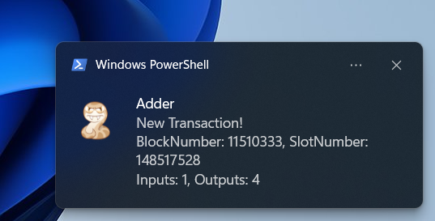

# Watch a Token and get a Desktop Notification

In this example we will use Adder to send us a desktop notification when there is a transaction that includes a certain token or asset that we want to track.

> ✅ For this guide we assume you have already downloaded the Adder exe and have opened a command prompt. If not see our [Quick Start](../quick-start/quick-start-overview.md) guide.

***

Let us start by picking an asset that we want to follow.

## Step 1 - Get Asset ID / Fingerprint

In order to filter by a Token that we want to watch we need the asset id also known as the asset fingerprint. We can use tools like [cexplorer.io](https://www.cexplorer.io) to search by a token name so we can get the asset id / asset fingerprint.

<div align="left"><figure><figcaption></figcaption></figure></div>

📝Make note of the asset fingerprint, we will need it later. For this example, we used the following asset id / asset fingerprint:

```
asset1uaxup2yv695uat3chgwqtpg9xvau55pd5z6r46
```

***

Now that we have our asset id / fingerprint that we want to monitor, we are ready to look at the filters and commands we will use. For this example, we will use:

* Filter Asset
* Filter Type
* Output

## Filter Asset

We can use the asset fingerprint from above for cTOSI to have Adder track transactions with that fingerprint by using the following filter:

```
-filter-asset asset1uaxup2yv695uat3chgwqtpg9xvau55pd5z6r46
```

## Filter Type - Transaction

For this example, we want to get alerts when a transaction occurs using the cTOSI asset id / fingerprint. To do this we will add the following filter:

```
-filter-type chainsync.transaction
```

## Output

We want the output to be a desktop notification. So that when a transaction that contains cTOSI occurs, we will receive a desktop notification. To do this we will add the following command:

```
-output notify
```


***

## Putting it All Together

To get desktop notifications when a transaction includes the Tosidrop token cTOSI, we will run the following command in our command prompt:

> ⚠️ Please adjust the path to your Adder exe. In this example it's on the Desktop for user richm.


```
C:\Users\richm\Desktop\adder-v0.26.0-windows-amd64.exe -filter-type chainsync.transaction -filter-asset asset1uaxup2yv695uat3chgwqtpg9xvau55pd5z6r46 -output notify
```


### Congratulations!

Now you can minimize the window and let Adder run in the background. Anytime a transaction occurs containing cTOSI you will get a desktop alert.


<div align="left"><figure></figure></div>

***

> 💡TIP: You can get a list of all available commands by using the `-h` or `-help` flag.

See our other examples to see what else Adder can do and unlock the power of Adder 💪

1. [Example 1](example-1-watch-my-wallet-and-get-a-desktop-notification.md) - Watch My Wallet and get a Desktop Notification
2. [Example 2](example-2-watch-a-token-and-get-a-desktop-notification.md) - Watch a Token and get a Desktop Notification
3. [Example 3](example-3-watch-an-spo-and-get-an-alert-in-discord.md) - Watch an SPO and get an Alert in Discord
4. [Example 4](example-4-watch-a-smart-contract-for-a-specific-asset-id-and-get-a-desktop-notification.md) - Watch a Smart Contract for a Specific Asset ID and get a Desktop Notification
