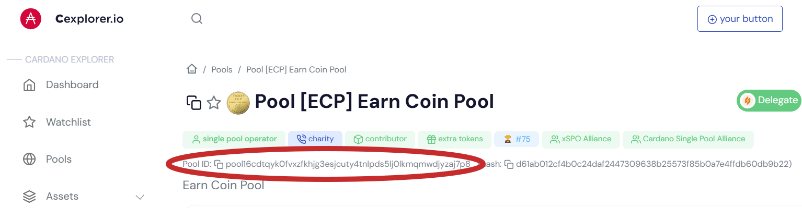
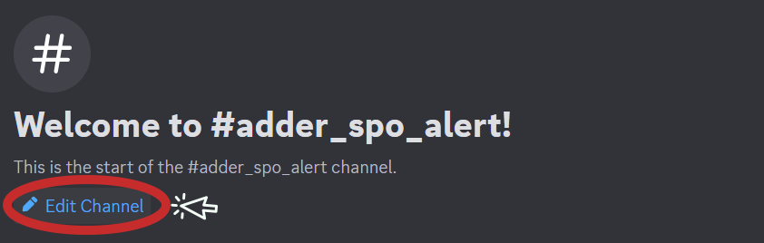
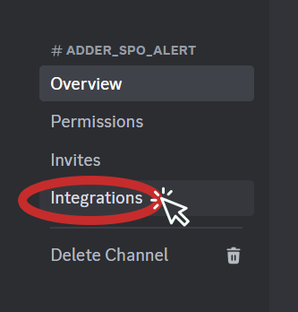
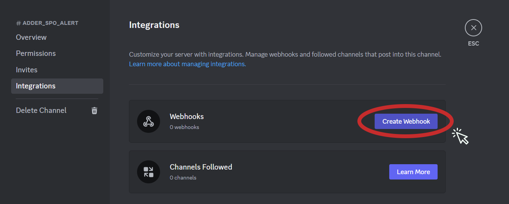
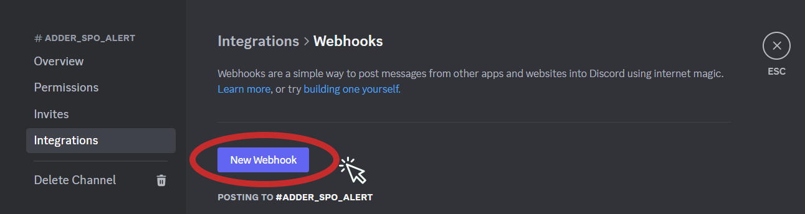
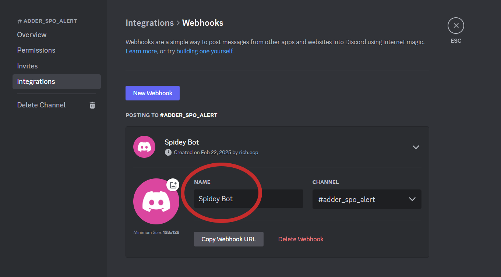
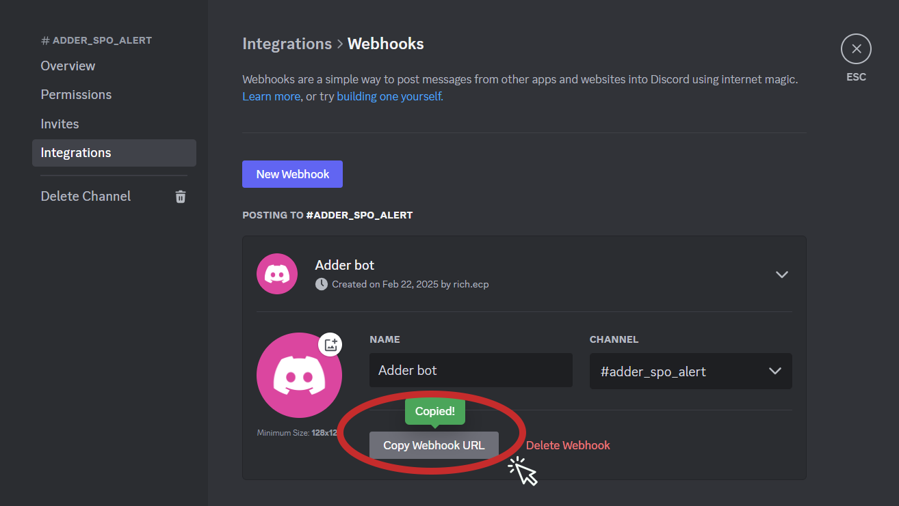
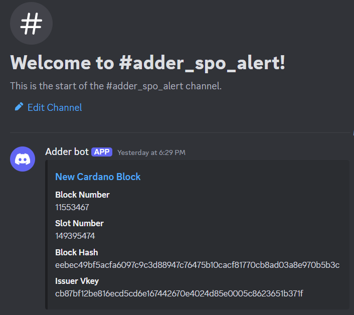

# Watch an SPO and get an Alert in Discord

In this example we will use Adder to send us a Discord notification via webhooks, when there is a change to the stake pool that we want to track. 


### The events that will trigger an alert are the following changes to a SPO:

✅Block Minted - if the SPO we are tracking mints a block

✅Stake Delegation - if the SPO we are tracking has a new delegator added to the pool

✅Pool Registration Updates - if the SPO changes items to it registration like, Relays, fix fee, margin, Name or metadata

✅Pool Retirement - if the SPO retires their stake pool

***

> ✅ For this guide we assume you have already downloaded the Adder exe and have opened a command prompt. If not see our [Quick Start](../quick-start/quick-start-overview.md) guide.

***

Before we breakdown the filters and commands we will use for this example we need to get a pool id to track and webhook URL so we can get alerts in our Discord. We will walk through the steps to get both of those below.

<a name="step-1" />

## Step 1 - Get Pool ID for the Pool you want to Track

In order to filter by a Stake Pool (SPO) that we want to watch we need the pool id. We can use tools like cexplorer.io to search by a Pool ticker so we can get the pool id.

In this example we searched the ticker `ECP` on [cexplorer.io](https://www.cexplorer.io)

<div align="left"><figure><figcaption></figcaption></figure></div>

<br />

📝Make note of the Pool ID, we will need it later. For this example, it was:

```
pool16cdtqyk0fvxzfkhjg3esjcuty4tnlpds5lj0lkmqmwdjyzaj7p8
```

***

<a name="step-2" />

## Step 2 - Get Discord webhook URL

In order to get alerts in our Discord server we will need a webhook URL. The following steps will walk you through how to create a webhook in your preferred channel in your Discord server.


<br />

1 ) Click `Edit Channel` in the channel that you would like to receive alerts in

<div align="left"><figure><figcaption></figcaption></figure></div>

<br />

2 ) Click `Integrations`

<div align="left"><figure><figcaption></figcaption></figure></div>

<br />

3 ) Click `Create Webhook`

<div align="left"><figure><figcaption></figcaption></figure></div>

<br />

4 ) Click `New Webhook`

<div align="left"><figure><figcaption></figcaption></figure></div>

<br />

5 ) Name your Webhook&#x20;

<div align="left"><figure><figcaption></figcaption></figure></div>

<br />

6 ) Click `Copy Webhook URL`

<div align="left"><figure><figcaption></figcaption></figure></div>

<br />

📝Make sure you make note of your Webhook URL we will need it later. For this example, the Webhook URL we used is:

```
https://discord.com/api/webhooks/1342941446373773342/Wo1bXhSouY5fKdv2frsUQlOnT5UTa9heCxinN_B13AUTuaQ0IOzxzr9ZYsa4co2VN3mi
```

***

Now that we have the pool id that we want to monitor and our Discord webhook URL, we are ready to look at the filters and commands we will use. For this example, we will use:

* Filter Type
* Filter Pool
* Output Webhook
* Output Webhook Format
* Output Webhook URL


***

## Filter Type

We don't want alerts of block rollbacks so we can use the filter type transaction and block. Since we want to use two filter types we separate them with a comma. To have Adder exclude the rollback alerts by using transaction and block filter, we will use the following filter:

```
-filter-type chainsync.transaction,chainsync.block
```

## Filter Pool

We can use the pool id from [Step 1](#step-1) to have Adder track our SPO by using the following filter:

```
-filter-pool pool16cdtqyk0fvxzfkhjg3esjcuty4tnlpds5lj0lkmqmwdjyzaj7p8
```

## Output Webhook

We need to add a command to let Adder know that we want to use a webhook. To do this we will add the following command:

```
-output webhook
```

## Output Webhook Format

Since we want Adder to notify us in Discord, we need to tell Adder the webhook format we want to use is Discord. To do this we will add the following command:

```
-output-webhook-format discord
```

## Output Webhook URL

For us to get a notification in our preferred Discord channel, we need to tell Adder the URL to the Discord Webhook. To do this we will add the following command using the Webhook URL from [Step 2](#step-2):

```
-output-webhook-url https://discord.com/api/webhooks/1342941446373773342/Wo1bXhSouY5fKdv2frsUQlOnT5UTa9heCxinN_B13AUTuaQ0IOzxzr9ZYsa4co2VN3mi
```


***

## Putting it All Together

To get Discord notifications when a change occurs to a SPO, we will run the following command in our command prompt:

> ⚠️ Please adjust the path to your Adder exe. In this example it's on the Desktop for user richm.\
> Also adjust the pool id and webhook URL.

```
C:\Users\richm\Desktop\adder-v0.26.0-windows-amd64.exe -filter-type chainsync.transaction, chainsync.block -filter-pool pool16cdtqyk0fvxzfkhjg3esjcuty4tnlpds5lj0lkmqmwdjyzaj7p8 -output webhook -output-webhook-format discord -output-webhook-url https://discord.com/api/webhooks/1342941446373773342/Wo1bXhSouY5fKdv2frsUQlOnT5UTa9heCxinN_B13AUTuaQ0IOzxzr9ZYsa4co2VN3mi
```

<div align="left"><figure><figcaption></figcaption></figure></div>

### Congratulations!

Now you can minimize the window and let Adder run in the background. Anytime a change occurs to our Pool we will get an Alert in Discord.

***


> 💡TIP: You can get a list of all available commands by using the `-h` or `-help` flag.

See our other examples to see what else Adder can do and unlock the power of Adder 💪

1. [Example 1](example-1-watch-my-wallet-and-get-a-desktop-notification.md) - Watch My Wallet and get a Desktop Notification
2. [Example 2](example-2-watch-a-token-and-get-a-desktop-notification.md) - Watch a Token and get a Desktop Notification
3. [Example 3](example-3-watch-an-spo-and-get-an-alert-in-discord.md) - Watch an SPO and get an Alert in Discord
4. [Example 4](example-4-watch-a-smart-contract-for-a-specific-asset-id-and-get-a-desktop-notification.md) - Watch a Smart Contract for a Specific Asset ID and get a Desktop Notification
