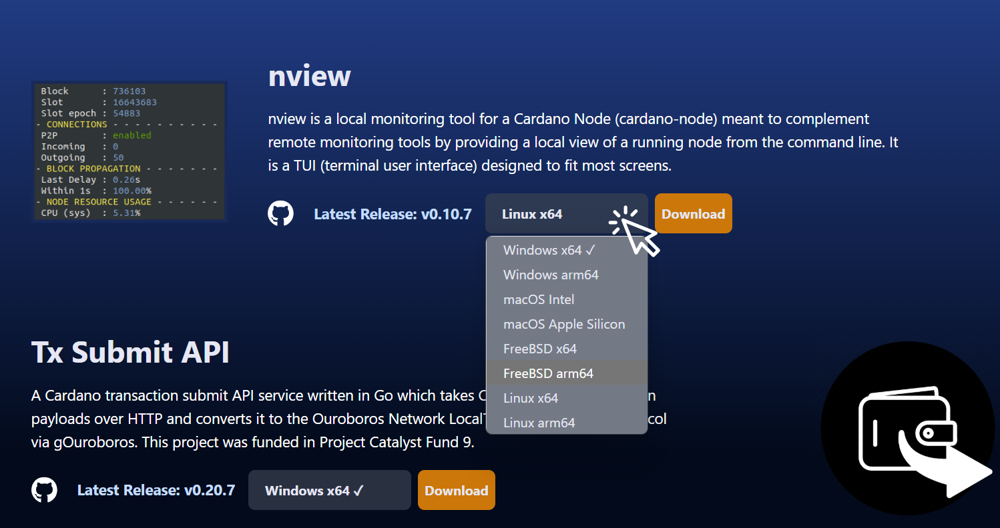
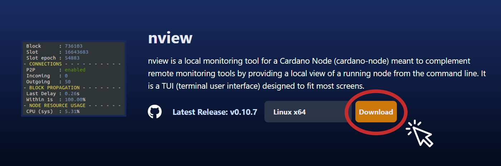
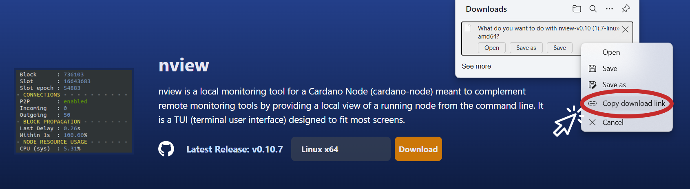

# Quick Start

nview is a local monitoring tool for a Cardano Node (cardano-node) meant to complement remote monitoring tools by providing a local view of a running node from the command line. It is a TUI (terminal user interface) designed to fit most screens. 

Simply download the nview binary file from blinklabs.io on to your node server. Run in server command line. It's that simple to use and you will get motioring right out of the box!

***


To get started follow the steps below

## Step 1 - Download binary from Blinklabs

1. First start by going to <a href="https://blinklabs.io/projects-open-source" target="_blank">https://blinklabs.io/projects-open-source</a> and scroll down to nview. 
<br>

2. Select your operating system of your node server.

<div align="left"><figure><figcaption></figcaption></figure></div>
<br>

3. You can either download the file and move to your node server or...  

<div align="left"><figure><figcaption></figcaption></figure></div>

<br>

Copy the path to the file and run the following command to download on your node server

<div align="left"><figure><figcaption></figcaption></figure></div>

<br>

⚠️Adjust link path to correct path for the version you want to download

```
wget -cO - https://github.com/blinklabs-io/nview/releases/download/v0.10.7/nview-v0.10.7-linux-amd64 > nview
```

***


## Step 2 - Change Permissions

For this example, we named the binary file nview and saved the file to our `$NODE_HOME` folder. To make the file executable run the following command:

```
chmod +x $NODE_HOME/nview
```

INSERT IMAGE
<div align="left"><figure><figcaption></figcaption></figure></div>

***


## Step 3 Run nview

Run the executable file by running the following command.

```
cd $NODE_HOME
./nview
```

INSERT IMAGE
<div align="left"><figure><figcaption></figcaption></figure></div>

***


### Congratulations you are ready to start using nview!

Want to adjust the configuration file of nview? See our how to use a configuration file for nview.
